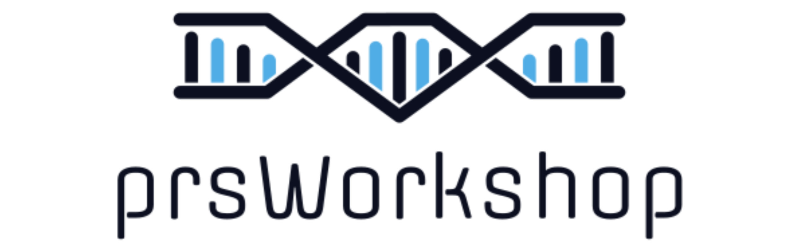

 

# PRS Japan Workshop is Almost Here!: Aug 31, 2024 

**Attendees should complete the [pre-workshop checklist!](prep_list.md)** 

Download pre-workshop materials [here.](prep_testing.md) 

This short workshop will equip scientists with the tools and approaches required to perform polygenic risk score (PRS) analyses. The workshop will include both applied and theoretical topics in PRS research, delivered across multiple lectures, seminars and computational practicals. In order that students are properly prepared for the workshop, then they must complete this "Pre-Workshop Guide" first, by going through each of the sections shown on the left of the screen, starting with 'Checklist'. 

