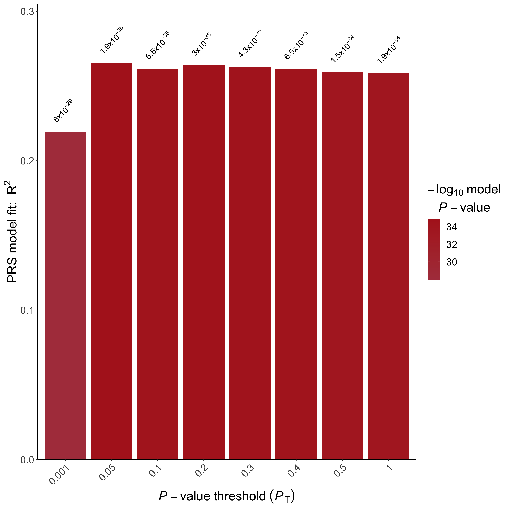
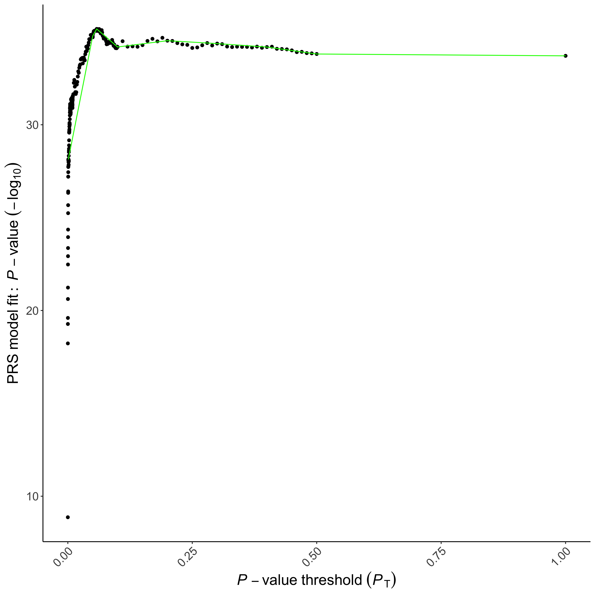
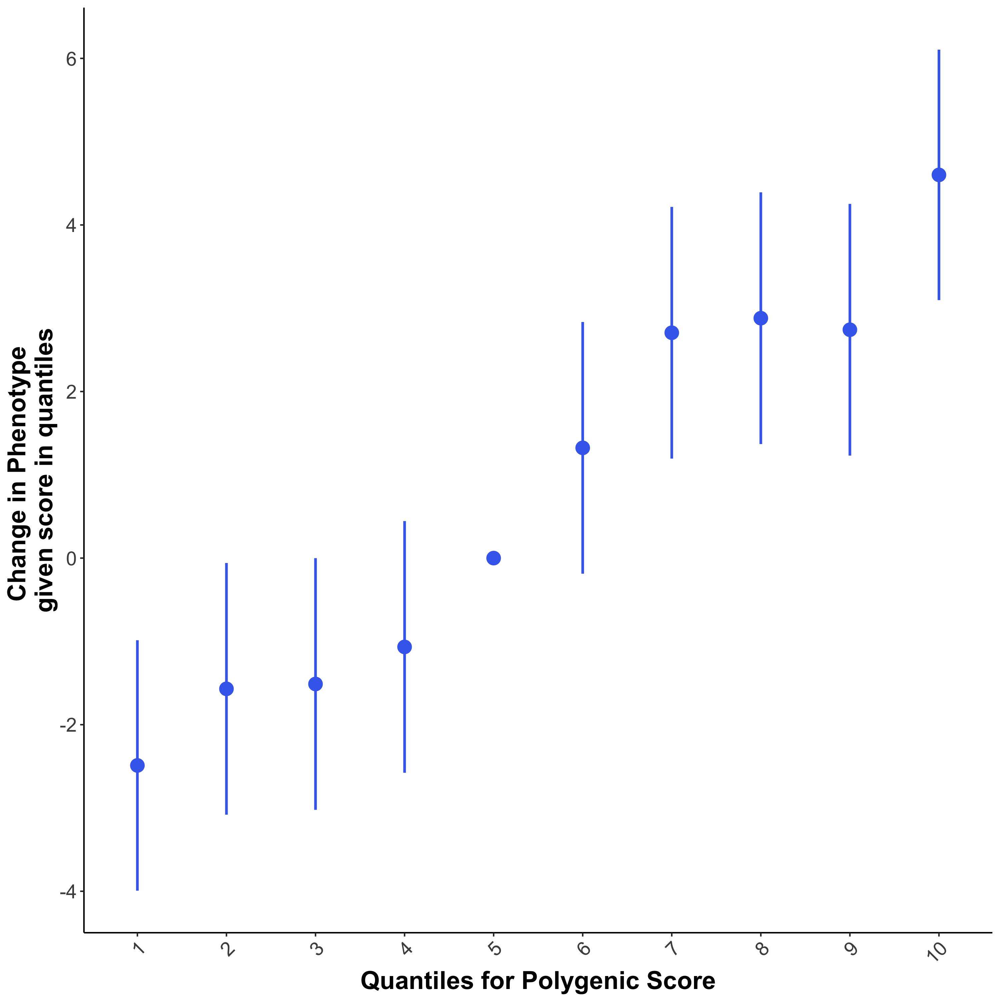
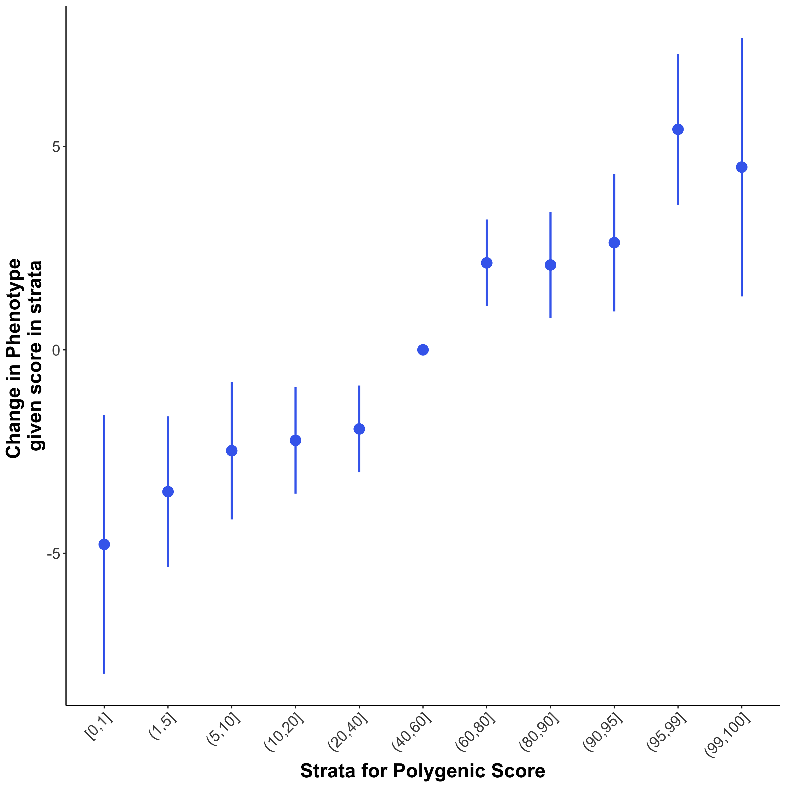
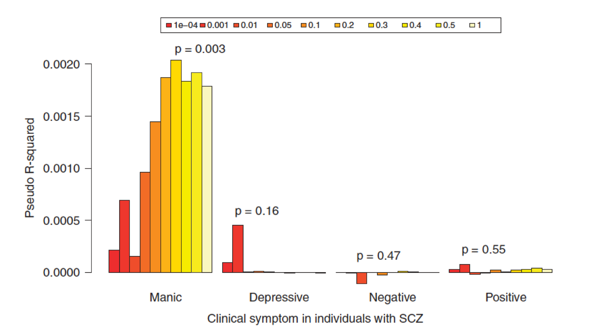

# Introduction to Polygenic Scores Analyses

## 1.1 Key Learning Outcomes
After completing this practical, you should be able to:

1.  Perform basic Polygenic Risk Score (PRS) analyses using PRSice:
    ([Euesden, Lewis & O'Reilly 2015](https://doi:10.1093/bioinformatics/btu848);[Choi & O'Reilly 2019](https://doi:10.1093/gigascience/giz082))
2.  Interpret results generated from PRS analyses
3.  Customise visualisation of results

## 1.2 Resources you will be using
To perform PRS analyses, summary statistics from Genome-Wide Association Studies (GWAS) are required. In this workshop, the following summary statistics are used:

|**Phenotype**|**Provider**|**Description**|**Download Link**|
|:---:|:---:|:---:|:---:|
|Height|[GIANT Consortium](https://portals.broadinstitute.org/collaboration/giant/index.php/GIANTconsortium_data_files)|GWAS of height on 253,288 individuals| [Link](https://portals.broadinstitute.org/collaboration/giant/images/0/01/GIANT_HEIGHT_Wood_et_al_2014_publicrelease_HapMapCeuFreq.txt.gz)|
|Coronary artery disease (CAD)|[CARDIoGRAMplusC4D Consortium](http://www.cardiogramplusc4d.org/)|GWAS on 60,801 CAD cases and 123,504 controls| [Link](http://www.cardiogramplusc4d.org/media/cardiogramplusc4d-consortium/data-downloads/cad.additive.Oct2015.pub.zip)|


!!! Warning
     All target phenotype data in this worshop are **simulated**. They have no specific biological meaning and are for demonstration purposes only. 

## 1.3 PRS Definition
A Polygenic Risk Score (PRS) is an estimate of an individual’s genetic propensity to a phenotype, calculated as a sum of their genome-wide genotypes, weighted by corresponding genotype effect sizes obtained from GWAS summary statistics. 
In the next section we will consider what the effect size means and how it is used in computing PRS. 
	


## 1.4 Understanding GWAS Summary Statistics

When GWAS are performed on a quantitative trait, the effect size is
typically given as a beta coefficient ($\beta$) from a linear regression
 with Single Nucleotide Polymorphism (SNP) genotypes as predictor of
 phenotype. The $\beta$ coefficient estimates the increase in the phenotype
for each copy of the *effect allele*. For example, if the effect
 allele of a SNP is **G** and the non-effect allele is **A** , then the
 genotypes **AA**, **AG** and **GG** will be coded as 0, 1 and 2
 respectively. In this scenario, the $\beta$ coefficient reflects how much
 the phenotype changes for each **G** allele present (NB. The $\beta$ can be
 positive or negative - so the 'effect allele' is simply the allele
 that was coded in the regression, not necessarily the allele with a
 positive effect).

 When a GWAS is performed on a binary trait (e.g. case-control study),
 the effect size is usually reported as an Odd Ratios (OR). Using the
 same example, if the OR from the GWAS is 2 with respect to the **G**
 allele, then the OR of **AG** relative to **AA** is 2, and the OR of
 **GG** relative to **AA** is 4. So an individual with the **GG**
 genotype are estimated\* to be 4 times more likely to be a case than
 someone with the **AA** genotype (\*an Odds Ratio is itself an
 estimate of a Risk Ratio, which cannot be calculated from a
 case/control study)

---
!!! Information
     The relationship between the $\beta$ coefficient from the logistic regression and the OR is: 
     $$
     OR = e ^ \beta
     $$
     and 
     $$
     log_{e}(OR) = \beta
     $$

     While GWAS sometimes convert from the $\beta$ to the OR when reporting results, most PRS software convert OR back to $\beta$'s ($log_e(OR)$) to allow simple addition of $log_e(OR)$'s.

!!! Question
     Column names are not standardised across reported GWAS results, thus it is important to check which column is the effect (coded) allele and which is the non-effect allele. For example, in the height GWAS conducted by the GIANT consortium, the effect allele is in the column Allele1, while Allele2 represents the non-effect allele.


     Let us open the Height GWAS file (**day1a/Base_Data/GIANT_Height.txt**) and inspect the SNPs at the top of the file. If we only consider SNPs *rs4747841* and *rs878177*, what will the ‘PRS’ of an individual with genotypes **AA** and **TC**, respectively, be? And what about for an individual with **AG** and **CC**, respectively? (Careful these are not easy to get correct! This shows how careful PRS algorithms/code need to be).

     What do these PRS values mean in terms of the height of those individuals?

---


## 1.5 Matching the Base and Target Data sets

 The first step in PRS calculation is to ensure consistency between the GWAS summary statistic file (*base data*) and the target genotype file (*target data*). Since the base and target data are generated independently, they often relate to different SNPs and so the first job is to identify the overlapping SNPs across the two data sets and remove non-overlapping SNPs (this is usually done for you by PRS software). If the overlap is low then it would be a good idea to perform imputation on your target data to increase the number of SNPs that overlap between the data sets.
 
 The next, more tricky issue, is that the genotype encoding between the data sets may differ. For example, while the effect allele of a SNP is **T** in the base data, the effect allele in the target might be **G** instead. When this occurs, *allele flipping* should be performed,where the genotype encoding in the target data is reversed so that **TT**, **TG** and **GG** are coded as 2, 1 and 0. Again, this is usually performed automatically by PRS software.

---

!!! Warning

     For SNPs that have complementary alleles, e.g. **A/T**, **G/C**, we cannot be certain that the alleles referred to in the target data correspond to those of the base data or whether they are the 'other way around' due to being on the other DNA strand (unless the same genotyping chip was used for all data). These SNPs are known as ***ambiguous SNPs***, and while allele frequency information can be used to match the alleles, we remove ambiguous SNPs in PRSice to avoid the possibility of introducting unknown bias.


## 1.6 Linkage Disequilibrium in PRS Analyses
GWAS are typically performed one-snp-at-a-time, which, combined with the strong correlation structure across the genome (Linkage Disequilibrium (LD)), makes identifying the independent causal genetic effects challenging. There are two main options to address this challenge when calculating PRS: 1. SNPs are *clumped* so that the retained SNPs are largely independent of each other, allowing their effects to be summed, assuming additive effects, 2. all SNPs are included and the LD between them is accounted for. 


 While option 2 is statistically appealing, option 1 has been most adopted in PRS studies so far, most likely due to its simplicity and the similarity of results of methods using the different options to date (Pain et al 2021). In this workshop we will consider option 1 (the "clumping+thresholding", or C+T, method), implemented in PRSice (Choi & O'Reilly 2019), but if you are interested in how LD can be incorporated as a parameter in PRS calculation then see the LDpred (Prive et al 2020), PRS-CS (Ge et al 2019) and SBayesRC (Zheng et al 2024) papers. 

---

### 1.6.1 Performing Clumping

Clumping is the procedure where a SNP data set is `thinned' by removing SNPs across the genome that are correlated (in high LD) with a nearby SNP that has a smaller association $P$-value. 
	
SNPs are first sorted (i.e. ranked) by their $P$-values. Then, starting from the most significant SNP (denoted as the *index SNP*), any SNPs in high LD (eg. $r^2$ > 0.1) with the index SNP are removed. To reduce computational burden, only SNPs that are within e.g. 250 kb of the *index SNP* are *clumped*. This process is continued until no *index SNPs* remain. 
	
Use the command below to perform clumping of the Height GWAS data using PLINK (Chang et al 2015). 
First, you will have to navigate to the `website_practical_downloads/day1a` folder using the terminal. 

 Next type the following command (NB. See warning below):

```
./Software/plink_mac \
     --bfile Target_Data/TAR \
     --clump Base_Data/GIANT_Height.txt	\
     --clump-p1 1 \
     --clump-snp-field MarkerName \
     --clump-field p \
     --clump-kb 250 \
     --clump-r2 0.1 \
     --out Results/Height

```

!!! Note
     You can copy & paste code from this document directly to the terminal.

The command above performs clumping on the height GWAS using LD calculated based on the **TAR** genotype file. SNPs that have $r^2>0.1$ within a 250 kb window of the index SNPs are removed. This will generate the **Height.clumped** file, which contains the SNPs retained after clumping. 

!!! Questions
     How many SNPs were in the GIANT_Height.txt file before clumping? 
	
	How many SNPs remain after clumping?
	
	If we change the $r^2$ threshold to 0.2, how many SNPs remain? Why are there now more SNPs remaining?
	
	Why is clumping performed for calculation of PRS? (in the standard approach)
	
## 1.7 Running PRSice: the "C+T" method
Now that we know how to perform the *clumping* part of the "clumping+thresholding" (C+T) method, in this section we will learn about the *thresholding* part, and we will learn how to run PRSice, which performs both parts (C+T) simultaneously. 

Deciding which SNPs to include is one of the key challenges in the calculation of PRS. 
A simple and popular approach is to include SNPs according to their GWAS association $P$-value. 
For example, we may choose to include only the genome-wide significant SNPs from the GWAS because those are the SNPs with significant evidence for association. 
In the next subsection you will compute PRS from GW-significant SNPs only, and then in the subsequent subsection you will generate multiple PRSs using different $P$-value thresholds. 

### 1.7.1 Height PRS using GW-significant SNPs only
Use the commands below to run PRSice with GIANT Height GWAS as base data and the height phenotype target data. 
PRSice will calculate Height PRS in the target data and then perform a regression of the Height PRS against the target individual's true height values. 
From the `day1a/` directory, run the following command in the terminal:

```
Rscript ./Software/PRSice.R \
     --prsice Software/PRSice_mac \
     --base  Base_Data/GIANT_Height.txt  \
     --target Target_Data/TAR \
     --snp MarkerName \
     --A1 Allele1 \
     --A2 Allele2 \
     --stat b \
     --beta \
     --pvalue p \
     --pheno Target_Data/TAR.height \
     --binary-target F \
     --bar-levels 5e-8 \
     --no-full \
     --fastscore \
     --out Results/Height.gws
```

This command takes the Height GWAS summary statistic file (`--base`), informs PRSice of the column name for the column containing the SNP ID (`--snp`), the effect allele (`--A1`), the non-effect allele (`--A2`), the effect size (`--stat`) and the $P$-value (`--pvalue`).
We also inform PRSice that the effect size is a $\beta$ coefficient (`--beta`) instead of an OR.
The `--binary-target F` command informs PRSice that the target phenotype is a quantitative trait and thus linear regression should be performed. 
In addition, we ask PRSice not to perform high-resolution scoring over multiple thresholds (--fastscore), and to compute the PRS using only those SNPs with $P$-value $< 5 \times 10^{-8}$ (`--bar-levels` and `--no-full`).

!!! Note
	The default of PRSice is to perform clumping with an $r^2$ threshold of 0.1 and a window size of 250kb.

	To see a full list of command line options available in PRSice type:

	```
	./Software/PRSice_mac -h
	```

     Take some time to look through some of these user options and you should be able to see why the above command produced the desired output. 


 PRSice performs strand flipping and clumping automatically and generates the **Height.gws.summary** file, together with other output that we will look into later in the practical.
The summary file contains the following columns:


1. **Phenotype** - Name of Phenotype
2. **Set** - Name of Gene Set. Default is *Base*
3. **Threshold** - Best P-value Threshold
4. **PRS.R2** - Variance explained by the PRS
5. **Full.R2** - Variance explained by the full model (including the covariates)
6. **Null.R2** - Variance explained by the covariates (none provided here)
7. **Prevalence** - The population disease prevalence as indicated by the user (not provided here due to testing continuous trait)
8. **Coefficient** - The $\beta$ coefficient corresponding to the effect estimate of the best-fit PRS on the target trait in the regression. A one unit increase in the PRS increases the outcome by $\beta$
9. **Standard.Error** - The standard error of the best-fit PRS $\beta$ coefficient (see above)
10. **P** - The $P$-value relating to testing the null hypothesis that the best-fit PRS $\beta$ coefficient is zero.
11. **Num_SNP** - Number of SNPs included in the best-fit PRS
12.  **Empirical-P** - Only provided if permutation is performed. This is the empirical $P$-value corresponding to the association test of the best-fit PRS - this controls for the over-fitting that occurs when multiple thresholds are tested.


 For now, we can ignore most columns and focus on the **PRS.R2** and the **P** column, which provide information on the model fit.

!!! Questions
	What is the $R^2$ for the PRS constructed using only genome-wide significant SNPs?
	
	What is the $P$-value for the association between the PRS and the outcome? Is this significant? (explain your answer). 
	
---

### 1.7.2 Height PRS across multiple P-value thresholds
A disadvantage of using only genome-wide significant SNPs is that there are likely to be many true signals among SNPs that did not reach genome-wide significance. 
However, since we do not know what $P$-value threshold provides the "best" prediction for our particular data, then we can calculate the PRS at several $P$-value thresholds and test their prediction accuracy to identify the "best" threshold (NB. See Dudbridge et al 2013 for theory on factors affecting the best threshold). 
This process is implemented in PRSice and can be performed automatically as follows:

```
Rscript ./Software/PRSice.R \
     --prsice Software/PRSice_mac \
     --base  Base_Data/GIANT_Height.txt \
     --target Target_Data/TAR \
     --snp MarkerName \
     --A1 Allele1 \
     --A2 Allele2 \
     --stat b \
     --beta \
     --pvalue p \
     --pheno Target_Data/TAR.height \
     --binary-target F \
     --fastscore \
     --out Results/Height.fast
```	

 By removing the `--bar-levels` and `--no-full` command, we ask PRSice to perform PRS calculation with a number of predefined thresholds (0.001, 0.05, 0.1, 0.2, 0.3, 0.4, 0.5, 1). 
The **.prsice** file is very similar to the **.summary** file, the only difference is that **.prsice** file reports the results of model fits for **all thresholds** instead of the most predictive threshold. 
This allow us to observe the change in model fitting across different thresholds, visualized by the BARPLOT (Fig.1.1) generated by PRSice. Open up the bar plot image file in the Results/ folder and take a look at the bar plot. 



!!! Questions
	Which is the most predictive threshold?
	
	What is the $R^2$ of the most predictive threshold and how does it compare to PRS generated using only genome-wide significant SNPs?


### 1.7.3 High-Resolution Scoring
If we only calculate PRS at a small number of $P$-value thresholds, then we might not observe the most predictive threshold. In PRSice, we can calculate and test PRS at a large number of thresholds using "high-resolution scoring" - which we can perform simply by removing the `--fastscore` command from the PRSice script. Run the following script to perform high-resolution scoring, and check the output files. 

```
Rscript ./Software/PRSice.R \
     --prsice Software/PRSice_mac \
     --base  Base_Data/GIANT_Height.txt \
     --target Target_Data/TAR \
     --snp MarkerName \
     --A1 Allele1 \
     --A2 Allele2 \
     --stat b \
     --beta \
     --pvalue p \
     --pheno Target_Data/TAR.height \
     --binary-target F \
     --perm 1000 \
     --out Results/Height.highres
```

 When PRSice performs high-resolution scoring, it will generate a plot (Fig.1.2) presenting the model fit of PRS calculated at a large number of *P*-value thresholds.



!!! Questions
	Which is the most predictive threshold?
	
	How much better is the threshold identified using high-resolution scoring, in terms of model $R^2$?
	
	What is the empirical P-value and is it significant? 
	
	Should we use the raw P-value or the empirical $P$-value? Why? 

	 Which command line option generated the empirical $P$-value? 
		


!!! Information
     To save time, we will not generate the empirical $P$-value for most of the rest of this practical. However, when using PRSice for your analyses you should always generate the empirical $P$-value to check whether the PRS association with the target phenotype is significant when multiple testing (across multiple thresholds) is accounted for.


## 1.8 Accounting for Covariates

 When performing PRS analyses, we often want to account for the effect of covariates. 
Based on user inputs, PRSice can automatically incorporate covariates into its model. For example, the following commands will include sex into the regression model as a covariate:

```
Rscript ./Software/PRSice.R \
     --prsice Software/PRSice_mac \
     --base  Base_Data/GIANT_Height.txt \
     --target Target_Data/TAR \
     --snp MarkerName \
     --A1 Allele1 \
     --A2 Allele2 \
     --stat b \
     --beta \
     --pvalue p \
     --pheno Target_Data/TAR.height \
     --binary-target F \
     --cov Target_Data/TAR.covariate \
     --cov-col Sex \
     --out Results/Height.sex
```

 When covariates are included in the analysis, PRSice will use the model fit of **only PRS** for all its output. 
This *PRS.$R^2$* is calculated from a formula that provides an unbiased estimate of the difference between the $R^2$ of the null model (e.g. $Height\sim Sex$) and the $R^2$ of the full model (e.g. $Height\sim Sex+PRS$). 

!!! Information
	Usually, Principal Components (PCs) are also included as covariates in the analysis to account for population structure. However, it can be tedious to type all 20 or 40 PCs (e.g. PC1,PC2,...,PC20). 
	In PRSice, you can add  **@** in front of the`--cov-col` string to activate the automatic substituation of numbers. 
	If **@** is found in front of the  `--cov-col` string, then any numbers within **[** and **]** will be parsed. E.g. `@PC[1-3]` will be read as *PC1,PC2,PC3*. Discontinuous input are also supported: `@cov[1.3-5]` will be parsed as *cov1,cov3,cov4,cov5*. 
	You can also mix it up E.g. `@PC[1-3],Sex` will be interpret as *PC1,PC2,PC3,Sex* by PRSice.

!!! Questions
	How does the inclusion of sex as a covariate change the results?


 If you want to control for the effect of a **categorical variable**, such as socio-economic status (SES) or smoking status, then you can use the option `--cov-factor` in PRSice to automatically generate "dummy variables" corresponding to different levels of the factor. The following command shows how this can be done (using sex as an example):

```
Rscript.exe ./Software/PRSice.R  \
     --prsice Software/PRSice_mac \
     --base  Base_Data/GIANT_Height.txt \
     --target Target_Data/TAR \
     --snp MarkerName \
     --A1 Allele1 \
     --A2 Allele2 \
     --stat b \
     --beta \
     --pvalue p \
     --pheno Target_Data/TAR.height \
     --binary-target F \
     --cov Target_Data/TAR.covariate \
     --cov-col Sex \
     --cov-factor Sex \
     --out Results/Height.sex
```


## 1.9 Case-Control Studies
In the previous exercises, we performed PRS analyses on height, which is a quantitative trait. 
For binary phenotypes (e.g case-control) there are a number of differences in the analysis:

1. Logistic regression has to be performed instead of linear regression
2. ORs are usually provided and should be converted to $\beta$'s when constructing PRS so that they can be simply added across the genome


Here we will use CAD as an example.
You will find the summary statistics under `Base_Data` (**Cardio_CAD.txt**) and the phenotype file (**TAR.cad**) under `Target_Data`.
You will also need to specify `--binary-target T` in the PRSice command to indicate that the phenotype is binary. 

!!! Information
	GWAS summary statistics for binary traits tend to report the OR instead of the $\beta$ coefficient, in which case the `--or` should be used.
	However, CARDIoGRAM plus C4D consortium provided the $\beta$ coefficient, therefore we will include `--beta` in our code and specify `--binary-target T` to indicate that the phenotype is binary. 


```
Rscript ./Software/PRSice.R \
     --prsice Software/PRSice_mac \
     --base  Base_Data/Cardio_CAD.txt \
     --target Target_Data/TAR \
     --snp markername \
     --A1 effect_allele \
     --A2 noneffect_allele \
     --chr chr \
     --bp bp_hg19 \
     --stat beta \
     --beta \
     --pvalue p_dgc \
     --binary-target T \
     --pheno Target_Data/TAR.cad \
     --perm 100 \
     --out Results/CAD.highres
```

!!! Information
	If `--chr` and `--bp` are added to the command line (as above) then PRSice can check whether the SNPs in the Base and Target data have the same chromosomal coordinates. 


!!! Questions
	What is the $R^2$ and $P$-value of the best-fit PRS?
	
	Does this suggest that there is a significant association between the CAD PRS and CAD status in the target sample? 


## 1.10 Generating PRS Quantile Plots
When considering the potential clinical utility of PRS, researchers often want to see the risk of disease among individuals in e.g. the top 5% or top 1% of PRS values compared to the rest of the population. Quantile plots are a nice way to illustrate the potential clinical utility of PRS (Fig.1.3) - made popular in the landmark PRS paper on the effects of PRS on cardiovascular disease by Khera et al (2018) - but should also be interpreted with some caution (see Fig.5 in: Choi, Mak & O'Reilly 2020).

 To generate quantile plots in PRSice, simply add the `--quantile` option and specify the number of quantiles that you would like to plot (e.g.  `--quantile 10` for deciles).

!!! Note
	If you have already calculated the PRS using a previous command, then we can skip repeating the same calculation by using the `--plot` option




```
Rscript ./Software/PRSice.R \
    --prsice Software/PRSice_mac \
    --base Base_Data/Cardio_CAD.txt \
    --target Target_Data/TAR \
    --snp markername \
    --A1 effect_allele \
    --A2 noneffect_allele \
    --chr chr \
    --bp bp_hg19 \
    --stat beta \
    --beta \
    --pvalue p_dgc \
    --binary-target T \
    --pheno Target_Data/TAR.cad \
    --perm 100 \
    --quantile 10 \
    --plot \
    --out Results/CAD.highres
```

!!! Information
	The `--plot` option tells PRSice to generate the plots without re-running the whole PRSice analysis. 
	This is useful when you want to change some of the parameters for plotting e.g. the number of quantiles. **Try running the previous command with 20 quantiles - and again with 50 quantiles - checking the quantile plot each time.**


!!! Questions
     What is the approximate higher risk of CAD for individuals in the top 5% of CAD PRS compared to those individuals with an average CAD PRS?


 Quantile plots only separate samples into quantiles of equal size. However, we can also use PRSice to produce a more flexible "strata plot", where quantiles of different sizes can be displayed in the same plot (e.g. Fig.1.3). We use  `--quant-break`, corresponding to the upper bound of each strata, and `--quant-ref`, which represents the upper bound of the reference quantile (best for interpretation of results if this is the central quantile):




```
Rscript ./Software/PRSice.R \
    --prsice Software/PRSice_mac \
    --base Base_Data/Cardio_CAD.txt \
    --target Target_Data/TAR \
    --snp markername \
    --A1 effect_allele \
    --A2 noneffect_allele \
    --chr chr  \
    --bp bp_hg19 \
    --stat beta \
    --beta \
    --pvalue p_dgc \
    --binary-target T \
    --pheno Target_Data/TAR.cad \
    --perm 100 \
    --quantile 100 \
    --quant-break 1,5,10,20,40,60,80,90,95,99,100 \
    --quant-ref 60 \
    --plot \
    --out Results/CAD.highres
```
    
!!! Note
	You can see these results as plots in the files \*\_QUANTILES_PLOT\_\* or 
	\*\_STRATA_PLOT\_\*, while the quantile results can also be seen in Table form in the \*\_QUANTILES\_\* file.
	The results shown in the quantile and strata plots here do not show much higher risk in the top quantiles, but this is because our simulated target data are small.


### 1.11 Cross-Trait Analysis
A popular application of PRS is in performing cross-trait analyses. 
This allows some interesting analyses such as those performed by Ruderfer et al 2014 (Fig.1.5), which used the bipolar PRS to predict into different clinical dimensions of schizophrenia.

<!--  -->

 In this practical, we will perform cross-trait analyses between CAD and Height, using height as the base and CAD as the target. 

```
Rscript ./Software/PRSice.R \
     --prsice Software/PRSice_mac \
     --base Base_Data/GIANT_Height.txt \
     --target Target_Data/TAR \
     --snp MarkerName \
     --A1 Allele1 \
     --A2 Allele2 \
     --stat b \
     --beta \
     --pvalue p \
     --pheno Target_Data/TAR.cad \
     --binary-target T \
     --out Results/Cross.highres
```

!!! Questions
	What is the $R^2$ for the most predictive threshold when using height as the base phenotype and CAD as the target phenotype?
	
	Now try using CAD as the base to predict height as the target trait? What is the PRS $R^2$ for that? 
	
	Can you explain why the results might be different when the phenotypes have been switched between the base and target? Or do you think the results should be the same?
	


!!! Tip
     To perform a cross-trait analysis involving a large number of target traits, you can use the `--pheno-col` option, which allows multiple target phenotypes to be included in the analysis simultaneously.

