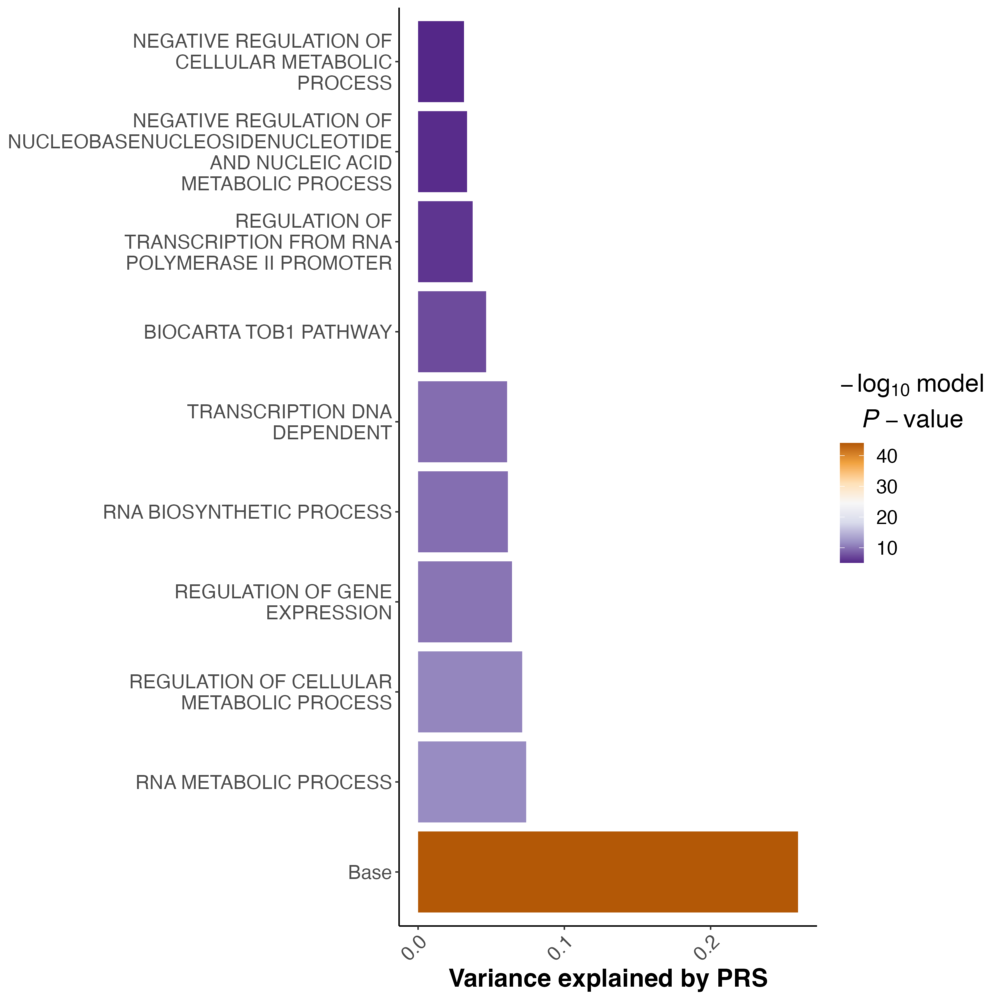
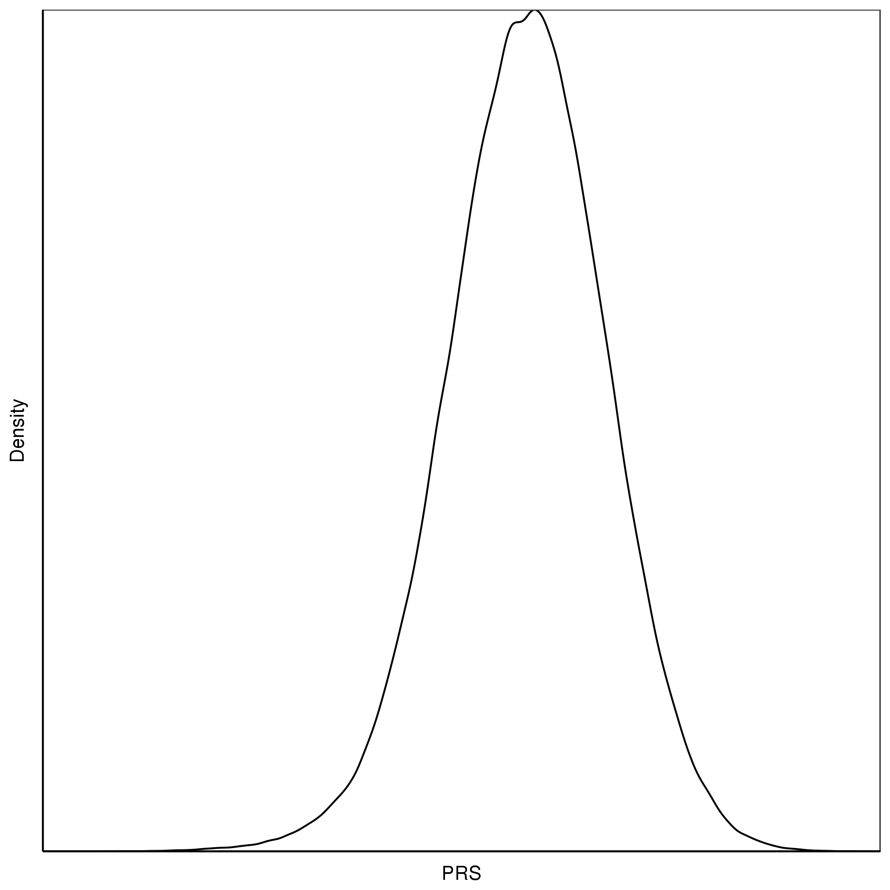
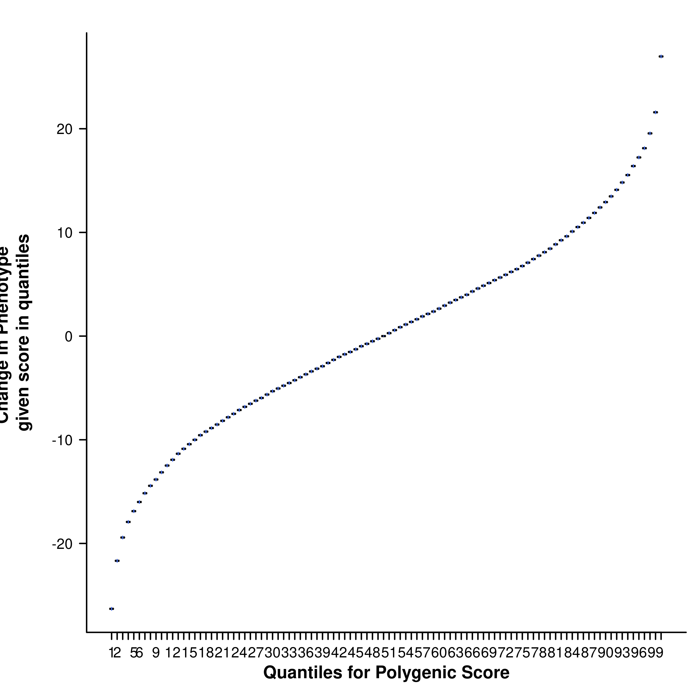

# Day 2 - Afternoon practical: Pathway PRS analyses


## Key Learning Outcomes
After completing this practical, you should be able to:

1. Understand the motivation and rationale for calculating gene set PRS.
2. Understand the inputs required for gene set PRS analysis using PRSet. 
3. Calculate gene set based PRSs using PRSet.
4. Understand and interpret the outcomes of gene set PRSs and how they differ from genome-wide PRS.


## Data Structure
You will find all practical materials in the [following link](https://drive.google.com/drive/folders/1NNtG9_pFJZeO9pH9WOQla7wj1AU-LDon?usp=sharing). Relevant materials that you should find at the start of the practical are:

 📂: Base_Data

- GIANT_Height.txt

 📂: Target_Data

- TAR.fam
- TAR.bim
- TAR.bed
- TAR.height
- TAR.covariate
    
📁: Reference

- Homo_sapiens.GRCh38.109.gtf.gz
- Sets.gmt


<a id="gene-set-analysis-intro"></a>
## Introduction to gene set (pathway) PRS analysis
Most PRS methods summarize genetic risk to a single number, based on the aggregation of an individual’s **genome-wide** risk alleles. This approach does not consider the different contributions of the various biological processes that can influence complex diseases and traits. 

During this session, you will learn how to run a gene set (or pathway) based PRS analyses. The key difference between genome-wide PRS and gene set or pathway-based PRSs analyses is that, instead of aggregating the estimated effects of risk alleles across the entire genome, gene set PRSs aggregate risk alleles across as many gene sets as the user defines (Figure 1).


<sub> **Figure 1:** The pathway polygenic risk score approach. Coloured boxes represent genes, lines link genes that are within the same genomic pathway. See full description [here](https://doi.org/10.1371/journal.pgen.1010624).
</sub>

---
!!! Note
     In this practical, we will go through some of the additional input requirements and considerations for the analysis of gene set PRS analysis, and will then calculate some gene set based PRS using [PRSet](https://choishingwan.github.io/PRSice/quick_start_prset/).

---

By aggregating PRS across multiple gene sets (or pathways), these PRS analyses will allow us to determine the genetic contribution made by each biological process in complex traits and diseases. For more information about the rationale and the software that we are going to use, please see the PRSet publication [PRSet: Pathway-based polygenic risk score analyses and software](https://doi.org/10.1371/journal.pgen.1010624). 

---
!!! Questions
     ❓ Why is it useful to have polygenic scores measured across gene-sets (or pathways) for individuals?
     
     ❓ Isn’t it sufficient to just obtain a ranking of gene-sets according to GWAS-signal enrichment (using gene set enrichment tools such as MAGMA or partitioned LDSC)?

---

<a id="prset-inputs"></a>
## Inputs required for gene-set PRS analysis
Summary statistics from GWAS, as well as individual level genotype and phenotype data are required to perform gene set PRS analyses. 

In this session, the following Base and Target data is used. Base data is publicly available. All Target data in this worshop are **simulated**. They have no specific biological meaning and are for demonstration purposes only. 


Additionally, to perform gene set PRS analyses, information about the gene sets for which we want to calculate the PRSs are required. In this tutorial, we will use as input gene-sets from the **Molecular Signatures Database** (in `Reference/`). Note that PRSet also takes as input **BED and SNP files**. 

|**Data Set**|**Description**|**Download Link**|
|:---:|:---:|:---:|
|Ensembl Human Genome GTF file|A file containing the coordinates for genes in the human genome. Used by PRSet to map the SNPs onto genic regions| [Link to Homo_sapiens.GRCh38.109.gtf.gz](https://ftp.ensembl.org/pub/release-109/gtf/homo_sapiens/) |
|MSigDB Gene Sets | File containing the gene-set information. *Free registration required.*| [Download link after registration](http://software.broadinstitute.org/gsea/msigdb/download_file.jsp?filePath=/resources/msigdb/6.1/h.all.v6.1.symbols.gmt)|


<a id="molecular-signatures-Database-msigdb"></a>
### Molecular Signatures Database MSigDB + General Transfer Format file
MSigDB offers an excellent source of gene sets, including the hallmark genes, gene sets of different biological processes, gene sets of different oncogenic signatures etc. All gene sets from MSigDB follows the Gene Matrix Transposed file format (GMT), which consists of one line per gene set, each containing at least 3 column of data:

| | | | | |
|:---:|:---:|:---:|:---:|:---:|
|Set A| Description | Gene 1 | Gene 2 | ...
|Set A| Description | Gene 1 | Gene 2 | ...

---
!!! Tips
     While you can read the GMT file using Excel, we recommend exploring these files using bash. You should be aware that Excel has a tendency to convert gene names into dates (e.g. SEPT9 to Sep-9)

---

**Have a look at the Reference/Sets.gmt file.**
!!! Questions
     ❓ How many gene sets are there in the Reference/Sets.gmt file? 
     
     ❓ How many genes does the largest gene set contain?

---

As GMT format does not contain the chromosomal location for each individual gene, an additional file (General Transfer Format file) is required to provide the chromosomal location such that SNPs can be mapped to genes.

The General Transfer Format (GTF) file contains the chromosomal coordinates for each gene. It is a **tab** separated file and all fields except the last must contain a value. You can read the full format specification [here](https://useast.ensembl.org/info/website/upload/gff.html). 

Two columns in the GTF file that might be of particular interest are:
- Column 3: **feature**, which indicates what feature that line of GTF represents. This allows us to select or ignore features that are of interest. 
  
- Column 9: **attribute**, which contains a semicolon-separated list of tag-value pairs (separated by a space), providing additional information about each feature. A key can be repeated multiple times.

---
!!! Tips
     To parse column 9 and split the additional information in separate columns, you can use the following R code:
     
     ``` {r}

     library(data.table)
     library(magrittr)

     # Function to extract attributes from column 9 in GTF files:
     extract_attribute = function(input, attribute) {
     strsplit(input, split = ";") %>%
     unlist %>%
     .[grepl(attribute, .)] %>%
     gsub("\"", "", .) %>%
     strsplit(., split = " ") %>%
     unlist %>%
     tail(n = 1) %>%
     return
     }

     gtf38 = fread("./Reference/Homo_sapiens.GRCh38.109.gtf.gz")

     gtf38_parsed = gtf38 %>%
     # Select genes only, based on column 3 (feature) 
     .[V3 == "gene"] %>%
     # Select genes located in autosomes
     .[`#!genebuild-last-updated 2022-11` %in% 1:22] %>%
     # Create colummns with Gene information
     .[, c("chr", "Gene_start", "Gene_end", "ensemblID", "Gene_Name", "Gene_biotype") := data.table(
     `#!genebuild-last-updated 2022-11`,
     V4,
     V5,
     sapply(V9, extract_attribute, "gene_id"),
     sapply(V9, extract_attribute, "gene_name"),
     sapply(V9, extract_attribute, "gene_biotype"))] %>%
     # Filter the columns of interest
     .[, c("chr", "Gene_start", "Gene_end", "ensemblID", "Gene_Name", "Gene_biotype")]

     ```

---

**Have a look at the Reference/Homo_sapiens.GRCh38.109.gtf.gz file.**

!!! Questions     
     ❓ Based on the column with information about the features, how many instances of feature = "gene" can you find ? 

     ❓ Based on the column with information about the attributes, how many protein-coding genes are there in the Reference/Homo_sapiens.GRCh38.109.gtf.gz file? 

---

<a id="other-inputs"></a>
### Other inputs that can be used for gene set PRS using PRSet

#### Browser Extensible Data BED
Browser Extensible Data (BED) file (different to the binary ped file from PLINK), is a file format to define genetic regions. It contains 3 required fields per line (chromosome, start coordinate and end coordinate) together with 9 additional optional field. A special property of BED is that it is a 0-based format, i.e. chromosome starts at 0, as opposed to the usual 1-based format such as the PLINK format. For example, a SNP on chr1:10000 will be represented as:

| | | |
|:---:|:---:|:---:|
|**1**|**9999**|**10000**|

---
!!! Questions
     ❓ How should we represent the coordinate of rs2980300 (chr1:785989) in BED format?
     
---

#### List of SNPs
Finally, PRSet also allow SNP sets, where the user have flexibility to decide what SNPs are included. The list of SNPs can have two different formats:
- SNP list format, a file containing a single column of SNP ID. Name of the set will be the file name or can be provided using ``--snp-set File:Name``
- MSigDB format: Each row represent a single SNP set with the first column containing the name of the SNP set.


<a id="exercise-4-gene-set-based-prs-analysis"></a>

## Exercise: Calculate gene set PRS analysis

To perform the PRSet analysis, we need to provide the GTF file and the GMT file to PRSice. Additionally, we want to specify the number of permutation to calculate competitive P-value calculation using the --set-perm option.

```
Rscript ./Software/PRSice.R \
    --prsice Software/PRSice_mac  \
    --base Base_Data/GIANT_Height.txt \
    --target Target_Data/TAR \
    --A1 Allele1 \
    --A2 Allele2 \
    --snp MarkerName \
    --pvalue p \
    --stat b \
    --beta \
    --binary-target F \
    --pheno Target_Data/TAR.height \
    --cov Target_Data/TAR.covariate \
    --out Height.set \
    --gtf Reference/Homo_sapiens.GRCh38.109.gtf.gz \
    --wind-5 5kb \
    --wind-3 1kb \
    --msigdb Reference/Sets.gmt \
    --multi-plot 10 \
    --set-perm 1000

```

---
**Compare the code to calculate a genome-wide PRS with PRSice (e.g. looking at yesterday's practical) and the code above to run PRSet**

!!! Questions
     ❓ What extra commands are used today to run gene set specific PRSs? What do these additional commands do?

---

## Results and Plots specific of gene set PRS analyses

### Competitive P-value calculation
When only one region of the genome is used to calculate PRSs (for example a gene set or a pathway PRSs), self-contained and/or competitive tests of association can be performed.

The null-hypothesis of self-contained and competitive test statistics is different:
- **Null-hypothesis for self-contained test** - None of the genes within the gene set are associated with the phenotype.
- **Null-hypothesis for competitive tests** - Genes within the gene set are no more associated with the phenotype than genes outside the gene set.

Importantly, in a self-contained test, a bigger gene-set will have a higher likelihood of having a significant P-value from self-contained test, which is not desirable. Therefore, competitive P-values should be calculated to account for gene set size, as shown in **Figure 2**.


**Figure 2** : Examples of significant and non-significant gene sets when running competitive tests of association.

---
**Check the .summary results file after running PRSice WITH and WITHOUT including the PRSet specific options**

!!! Questions
     ❓ How does the .summary output file change? What extra information (i.e. extra columns) are incorporated when including PRSet specific commands?
     
     ❓ What are the 3 gene-sets with the smallest self contained P-values?

     ❓ What are the 3 gene-sets with the smallest competitive P-values? 

**Imagine that you are running an analysis to find the gene sets most associated with height**

!!! Questions
     ❓ Considering both the competitive P-value results, what gene set do you think is the most interesting and why?

---

In addition to additional information in the output files, running the PRSet options will provide one extra figure with the results for the gene set PRS with the highest R2.


**Figure 3** : An example of the multi-set plot. Sets are sorted based on their self-contained R2. Base is the genome wide PRS.

<a id="considerations"></a>
## Other considerations when analysing and interpreting gene set PRSs

<a id="clumping"></a>
### Clumping for each gene set independently
In standard clumping and P-value thresholding methods, clumping is performed to account for linkage disequilibrium between SNPs. However, when performing set based analysis, special care are required to perform clumping. 
Take the following as an example:
Assume that:

- Light Blue fragments are the intergenic regions
- Dark Blue fragments are the genic regions
- Red fragments are the gene set regions
- SNPs are represented as thunder bolt, with the "index" SNP in clumping denoted by the green thunderbolt

If we simply perform a genome wide clumping, we might remove all SNPs residing within the gene set of interest, 
reducing the signal:


Therefore, to maximize signal within each gene set, we must perform clumping for each gene sets separately:


---

**Check the .summary results file (Do not count the Base, as this result corresponds to the genome-wide PRS)**

!!! Questions
     ❓ Can you plot the relationship between the gene set R2 and the number of SNPs in each gene set? What general trend can be seen?
     
---

<a id="thresholding"></a>
### P-value thresholding in gene set PRS analyses 
PRSet default option is to no not perform p-value thresholding. It will simply calculate the set based PRS at P-value threshold of 1. 

---
!!! Questions
     ❓ Why do you think that the default option of PRSet is P-value threshold of 1?

     ❓ In what cases would you like to apply P-value thresholding?
---


## Advanced Polygenic Risk Score Analyses


## Key Learning Outcomes
After completing this practical, you should be able to:
     
1. Know how to adjust for ascertainment bias in case-control analysis
2. Know how over-fitting affects PRS results and how to handle it 
3. Understand distribution of PRS

## Data Structure
 Relevant materials that you should find at the start of the practical are:

 📂: Base_Data

- GIANT_Height.txt
- Cardio_CAD.txt

 📂: Target_Data

- TAR.fam
- TAR.bim
- TAR.bed
- TAR.height
- TAR.cad
- TAR.covariate
- VAL.fam
- VAL.bim
- VAL.bed
- VAL.height
- VAL.covariate
    

!!! Warning
     Note All target phenotype data in this worshop are **simulated**. They have no specific biological meaning and are for demonstration purposes only. 


## Exercise 1: Estimating $R^2$ in case and control studies
Bias in $R^2$ estimation caused by ascertained case/control samples can be adjusted using the equation proposed by **Lee et al (2011)**, which requires the sample prevalence (case/control ratio) and population prevalence as parameters. This function is implemented in PRSice and the adjustment can be performed by providing the population prevalence to the command `--prevalence`.

Residuals of logistic regression is not well defined, and in PRS analyses, Nagelkerke $R^2$  is usually used to represent the model $R^2$ (this is the default of PRSice). However, this $R^2$ does not account for the difference between sample prevalence (i.e. case-control ratio) and population prevalence, which can lead to bias in the reported $R^2$ (Figure 1.1a). 

  **Figure 1.1: Performance of different $R^2$ when the study contains equal portion of cases and controls**

  **(a) Nagelkerke $R^2$** 

---

Bias in $R^2$ estimation caused by ascertained case/control samples can be adjusted using the equation proposed by **Lee et al. 2011 (Figure 1.1b)**, which requires the sample
prevalence (case/control ratio) and population prevalence as parameters. This function is implemented in PRSice and the adjustment can be performed by providing the population prevalence to the command `--prevalence`.


**Figure 1.1: Performance of different $R^2$  when the study contains equal portion of cases and controls**

**(b) Lee adjusted $R^2$ ** 

---


Now, account for the ascertainment of the case/control sample by including the population prevalence (let’s assume e.g. 5% here) in the PRSice command to obtain the adjusted (Lee) $R^2$  :

```
Rscript ./Software/PRSice.R \
     --prsice Software/PRSice_mac \
     --base  Base_Data/Cardio_CAD.txt  \
     --target Target_Data/TAR \
     --snp markername \
     --A1 effect_allele \
     --A2 noneffect_allele \
     --chr chr \
     --bp bp_hg19 \
     --stat beta \
     --beta \
     --pvalue p_dgc \
     --pheno Target_Data/TAR.cad \
     --prevalence 0.05 \
     --binary-target T \
     --out Results/CAD.highres.LEER2
```

The results are written to the "Results" directory. Examine the results folder and each file that was generated. For more information about each file type, see  [here](https://choishingwan.github.io/PRSice/step_by_step/).


!!! Note
     Check the *.summary file in the Results folder where you will find the usual (Nagelkerke) $R^2$  and the adjusted (Lee) $R^2$ .

**Figure 1.2: Barplot of CAD Lee $R^2$** 


!!! Tip
     To speed up the practical, we have generated a smaller gene-set file. If you want the full gene-set file, you can download it from the link above.
     
     All target phenotype data in this workshop are simulated. While they reflect the corresponding trait data, they have no specific biological meaning and are for demonstration purposes only.


!!! Questions
     ❓ Has accounting for the population prevalence affected the $R^2$ ?
     
     ❓ Would you expect a difference between the Nagelkerke $R^2$  and the Lee adjusted $R^2$  if the case/control ratio in the target sample reflects the disease prevalence in the population?
    

---

## Exercise 2: Overfitting caused by model optimisation

In PRS analyses, the shrinkage or tuning parameter is usually optimized across a wide range of parametric space (e.g. P -value threshold, proportion of causal SNPs). When both optimisation and association testing are performed on the target data, over-fitted results will be obtained. The accuracy and predictive power of over-fitted results are likely to diminish when replicated in an independent data set.

A simple solution is to perform permutation to obtain an empirical P -value for the association model, which is implemented in PRSice. Briefly, permutation is performed as follows:

1. Compute the P -value in your original data, denoted as obs.p, at the "best" threshold.
2. Then shuffle the phenotype and obtain the P -value of the "best" threshold for this null phenotype, denoted as null.p
3. Repeat 2 $N$ times
4. Calculate the empirical P-value ($P_{emp}$) as:

$$
P_{emp} =  \frac{\sum_{n=1}^NI(P_{null}\lt P_observed)+1}{N+1}
$$
where $I(.)$ is the indicator function. 
---

You will have to specify the number of permutation (N) to perform by providing `--perm N` as a parameter to PRSice.

```
Rscript ./Software/PRSice.R \
    --prsice Software/PRSice_mac \
    --base  Base_Data/GIANT_Height.txt \
    --target Target_Data/TAR \
    --snp MarkerName \
    --A1 Allele1 \
    --A2 Allele2 \
    --stat b \
    --beta \
    --pvalue p \
    --pheno Target_Data/TAR.height \
    --binary-target F \
    --cov Target_Data/TAR.covariate \
    --cov-col Sex \
    --perm 1000 \
    --out Results/Height.perm
```


**Figure 1.3: Barplot of Height using 1000 permutations**


!!! Note
     10000 permutations typically provide empirical P-values with high accuracy to the second decimal place (eg. 0.05), but smaller empirical P-values should be considered approximate. 


!!! Questions
     ❓ What is the smallest possible empirical P-value when 10000 permutation are performed? 
     
     ❓ Is the height PRS significantly associated with height after accounting for the over-fitting implicit in identifying the best-fit PRS? How about CAD?

---
### Out of Sample Validation

The best way to avoid having results that are over-fit is to perform validation on an independent validation data set. We can perform validation of the previous height + covariate analysis with PRSice, using the independent VAL target sample as validation data and the "best" P-value threshold predicted in the VAL samples:

```
Rscript ./Software/PRSice.R \
     --prsice Software/PRSice_mac \
     --base  Base_Data/GIANT_Height.txt \
     --target Target_Data/VAL \
     --snp MarkerName \
     --A1 Allele1 \
     --A2 Allele2 \
     --stat b \
     --beta \
     --pvalue p \
     --pheno Target_Data/VAL.height \
     --binary-target F \
     --no-full \
     --bar-levels 0.0680001 \
     --fastscore \
     --cov Target_Data/VAL.covariate \
     --cov-col Sex \
     --out Results/Height.val
```

  **Figure 1.4: Barplot of Height validation dataset** 


!!! Questions
     ❓ Why do we use `--bar-levels 0.0680001` `--no-full` and `--fastscore` in this script?

     ❓ How does the PRS R2 and P -value for the validation data set compare to the analysis on the TAR target data? Is this what you would expect? Why?


---
## Exercise 3: Distribution of PRS

Many PRS study publications include quantile plots that show an exponential increase in phenotypic value or / Odd Ratios (OR) among the top quantiles (e.g. an S-shaped quantile plot, e.g. Figure 1.6). 


**Figure 1.5: An example of density plot for PRS**

---
>
**Figure 1.6: An example of a S-shaped quantile plot**
>

---

This might lead us to believe that individuals with PRS values in the top quantiles have a distinctly different genetic aetiology compared to the rest of the sample, or that there is epistasis/interactions causing there substantially higher risk. However, when we plot a normally distributed variable (e.g. a PRS) as quantiles on the X-axis then we expect to observe this exponential pattern even when the X variable only has a linear effect on the Y variable. This is because the top (and bottom) quantiles are further away from each other on the absolute scale of the variable and so the differences in their effects are larger than between quantiles in the middle of the distribution.

To understand this more, we will perform a simple simulation using R:
``` R
# First, we define some simulation parameters
n.sample <- 10000
PRS.r2 <- 0.01
# Then, we simulate PRS that follow a random normal distribution
prs <- rnorm(n.sample)
# We can then simulate the phenotype using the following script
pheno <- prs + rnorm(n.sample,mean=0, sd=sqrt(var(prs)*(1-PRS.r2)/(PRS.r2)))
# We can examine the relationship between the phenotype and prs 
# using linear regression
summary(lm(pheno~prs))
# Which shows that we have the expected PRS R2
# Group the phenotype and PRS into a data.frame
info <- data.frame(SampleID=1:n.sample, PRS=prs, Phenotype=pheno)
# Then we can generate the quantile plot. 
# To save time, we will load in the quantile plot script from Software
source("./Software/Quantile.R")
# Then we can plot the quantile plot using quantile_plot function
quantile_plot(info, "Results/Height", 100)
```
>
  **Figure 1.7: The resulting quantile plot**
>


!!! Questions
     ❓ What is the shape of the resulting quantile plot?

     Try plotting the densities of the height or CAD PRS in R * - do they look normally distributed? Why? (*Hint: You can generate a density plot for the PRS in R using plot(density(x)) where x is a vector of the PRS values in the sample).


<a href="#top">[Back to Top](#table-of-contents)</a>
