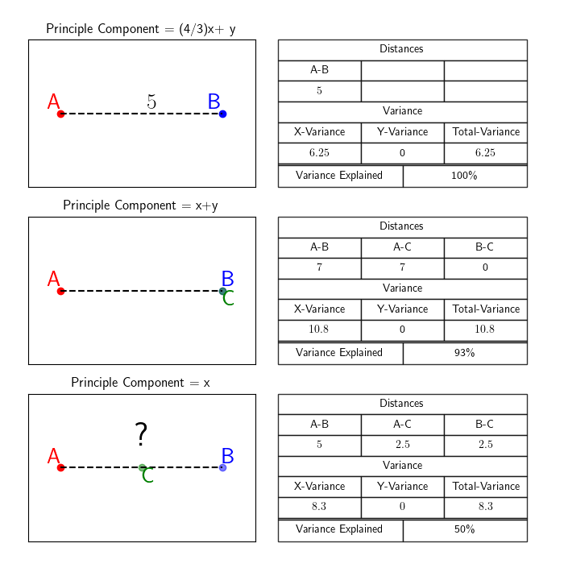

# Population Genetics And Ancestry Analysis

## Table of Contents
      
  1. [Key Learning Outcomes](#key-learning-outcomes)
  2. [Practical Data](#practical-specific-data) 
  3. [A Portability Problem](#ex-1-portability-problem) 
  4. [Population Genetics Basics](#ex-2-population-genetics) 
  5. [Dimensional Reduction: PCA](#ex-3-pca) 

---

## Key Learning Outcomes
After completing this practical, you should be able to:
  
  1. Run mixed ancestry PRS and understand the PRS Portability Problem.
  2. Understand principle component analysis and dimensional reduction.
  3. Understand basic population genetics and know how to analyze ancestry groups.
  4. Understand the challenges and limitations of applying PRS in populations with diverse genetic backgrounds.

<h5>Practical Specific Data</h5>

The data/software required for this practical can be found in the folder **day1b**.  Inside of this folder 
there are two folders, one for each operating system.  Please enter the correct directory, by typing one 
of the following two commands: 

    cd day1b/mac_version   # for users of macOs 
    cd day1b/linux_version # for users of Linux  


After doing this you should see the following directories: 

  - exercise1: Includes Data/Code to run multi-ancestry PRS    
  - exercise2: Includes Data/Code for principal component analysis 
  - exercise3: Includes Data/Code for population genetics analysis 

The downloaded code in these directories needs to be made executable on your machine.  You can do that now by 
typing: 

    chmod +x exercise*/code/* 

Additionally, if you are using macOs where there is extra security, you may need to follow the additional 
instructions to allow your computer to run software [here.](../../misc_plink_problem)  

---

## Ex 1: Portability Problem 

The first exercise of this practical takes place in the folder **exercise1**.  Once inside the folder you should 
see **code** and **data** directories.  Looking in the data directory by typing the following command will reveal: 
    
    ls data/* 


  1. 🇪🇺: **EURO_GWAS.assoc** (European Ancestry GWAS Sumstats) 
  2. 🇬🇧: **data/ukTarget** (Genotype Phenotype data From a population from the UK.)
  3. 🇯🇵: **data/japanTarget** (Genotype Phenotype data from a population from Japan.)


To start, run PRSice using the European GWAS and target data from the UK: 

    
    ./code/PRSice --base data/EURO_GWAS.assoc --target data/ukTarget/ukTarget --binary-target F --pheno data/ukTarget/ukTarget.pheno --out ukRun

Verify that this command produce a file called **"ukRun.best"** that contains individual prs-scores in fourth column.  This file can 
compared to the file **data/ukTarget/ukTarget.pheno** which contains phenotype-values in the third column. 

🚨 OPTIONAL-CHALLENGE 🚨

Using R, Python, or another program, consider calculating the correlation between the PRS and phenotype data in the two files? 

  - First read the pseudocode and see if you can follow the strategy. 
  - Then give it a try or read the following solutions and make sure that you understand them.  
  - Notice the differences in similarities in the programming languages. 

=== "Hints" 
    
    	#1) Step1: Read Both Files in. 
            prs_data = read('ukRun.best') 
            pheno_data = read("data/ukTarget/ukTarget.pheno") 
    	
		#2) Step2: Extract the correct Column from each file .
            prs_vals = extract_from(prs_data, column 4) 
            pheno_vals = extract_from(pheno_data, column 3) 
    	
		#3) Step3: Calculate the correlation. 
            R2 = calculate_R2_from_data(prs_vals, pheno_vals)  


=== "Solution (R)"

        R
        # read-in prs-file 
        prs1 <- read.table("ukRun.best", header = TRUE, sep = "", stringsAsFactors = FALSE)                                                                                                                                            
        prs.data <- prs1[,4]                                                                                                                                                                                                       
        
        # read-in pheno-file 
        pheno <- read.table("data/ukTarget/ukTarget.pheno", header = TRUE, sep = "", stringsAsFactors = FALSE)                                                                                                                                          
        pheno.data <- pheno[,3]                                                                                                                                                                                                     
        
        # Create DataFrame 
        combined_data <- data.frame( x = prs.data,  y = pheno.data)                                                                                                                                                                
        
        # Fit a linear model to the data                                                                                                                                                                                            
        model <- lm(y ~ x, data = combined_data)                                                                                                                                                                                    
        # Calculate the R-squared value                                                                                                                                                                                             
        r_squared <- summary(model)$r.squared  
        # return R2 
        print(r_squared) 

=== "Solution (Python)" 
        
        python3
        # read-in prs-file: 
        with open('ukRun.best') as F:  
            prs_vals = [float(line.split()[-1]) for i,line in enumerate(F.readlines()) if i > 0]                                                                                                              
    
        # read-in pheno-file: 
        with open('data/ukTarget/ukTarget.pheno') as F:  
            pheno_vals = [float(line.split()[-1]) for i,line in enumerate(F.readlines()) if i > 0]                                                                                                          
    
        # calculate correlation                                                                                                                                                                                                                
        prs_mean, pheno_mean = sum(prs_vals)/len(prs_vals), sum(pheno_vals)/len(pheno_vals)                                                                                                                                     
        rTop = sum([(x-prs_mean)*(y-pheno_mean) for x,y in zip(prs_vals, pheno_vals)])                                                                                                                                          
        rBottom = (sum([(x-prs_mean)*(x-prs_mean) for x in prs_vals])**0.5) * (sum([(x-pheno_mean)*(x-pheno_mean) for x in pheno_vals])**0.5)                                                                                   
                                                                                                                                                                                                                            
        # Return R2                                                                                                                                                                                                               
        R2 = (rTop/rBottom)*(rTop/rBottom)                                                                                                                                                                                                                                                                                                                                                                                                   
        print(R2)                                                                                                                                                                                                               
                
After you feel confident about the code, please run the following Rscript in the code directory to calculate the correlation and create a scatterplot using the UK PRS-result: 
```
    Rscript --vanilla code/plot_prs_results.R data/ukTarget/ukTarget.pheno ukRun.best
```
This will create a scatterplot file called: **ukRunScatterplot.pdf**.  
Verify that you can view this pdf.

Next type the commands below to reuse the European GWAS data
and PRSice with the genotype-phenotype data from Japan.  
```
    ./code/PRSice --base data/EURO_GWAS.assoc --target data/japanTarget/japanTarget --binary-target F --pheno data/japanTarget/japanTarget.pheno --out japanRun
    Rscript --vanilla code/plot_prs_results.R data/japanTarget/japanTarget.pheno japanRun.best
```
View the resulting scatterplot and answer the questions below.

**❓QUESTIONS:**

<details>
  <summary>In the UK-result, what percent of variance in phenotype is
  explained by prs?
<!--      </summary> Approximately 10%.   -->
</details>

<details>
  <summary>In the Japan-result, what percent of variance in phenotype
  is explained by prs?
<!--      </summary> Approximately 0%.   -->
</details>

<details>
  <summary>Besides a difference in variance explained, do you notice
  any other differences?
<!--      </summary> Less variance in PRS, a shift to the left.   -->
</details>

<details>
  <summary>What is the name of the problem that refers to this drop in
  performance?
<!--      </summary> The PRS Portability problem.   -->
</details>

<details>
  <summary>What are some causes of the problem?</summary>
  1. Differences in LD.
  2. Differences in allele frequency. 
  3. Differences in environment. 
  4. Differences in population-structure. 
</details>


---

<a href="#top">[Back to Top](#table-of-contents)</a>


### 1000 Genomes Data

We have observed the PRS-portability problem in practice.  Recall from
the lecture that the primary drivers of the PRS portability problem
are between population difference in allele frequency, linkage
disequilibrium and effect sizes.  In the next exercises we will use
1000 Genomes (1000G) data to compare allele frequencies and linkage
disequilibrium across populations.

The 1000G contains individuals from 26 source populations from five
super-populations, Europe, East Asia, South Asian, Africa and America.

Population structure and population assignment is often accomplished using 
principal components analysis (PCA). In the final exercise we learn what PCA is and how 
it can be used to separate population data by recent ancestry.

---


<a href="#top">[Back to Top](#table-of-contents)</a>


## Ex 2: Population Genetics 

This exercise takes place in the folder **exercise2**.  Once inside the folder you should 
see **code** and **data** directories.  Looking in the data directory by typing the following command: 
    
    ls data/* 


  1. 🌎: **chr1-22.bed/bim/fam** (Global Genotype Data) 
  2. 🏷️: **data/pop_info.pheno** (Population specific annotation data) 
  3. 💫: **data/all_phase3.king.psam** (Axillary Phase Data) 


### Sample size of each super-population

The first thing we would like to find out about this data is the
number of individuals in each super-population.  Type the
following command to query the number of European ancestry individuals
in the downloaded dataset:

    grep -F "EUR" data/all_phase3.king.psam | wc -l


Next, repeat the same command for East Asian, African, South Asian and American super-populations, by inserting the relevant ancestry codes (EAS, AFR, SAS, AMR).

🗒️ Make a note of how many individuals there are in each super-population.


### Number of genetic variants analysed

1000G data contains over 80 million variants genome-wide. The 1000G data we are using
in this practical is only a small fraction of these variants. This data gives 
a reliable approximation for the genomic analyses in this tutorial and importantly,
reduces the computation time required to complete the tutorial. The following command
counts the number of genetic variants on chromosomes 1-22 used in our analyses

    wc -l data/chr1-22.bim


### Number of polymorphic markers in each super-populations

The rate at which a genetic variant occurs in a population is known as its allele
frequency. Allele frequencies are shaped by evolutionary forces over a long period
of time and hence can vary between populations. This has implications for PRS research. The following
plink command uses the population information in the file pop_info.pheno to
generate allele frequency statistics for each SNP in the five 1000G super-populations:


    ./code/plink --bfile data/chr1-22 --snps-only --freq --within data/pop_info.pheno


Population-stratified allele frequency results are found in the output file plink.frq.strat.

Compare the totals against number of SNPs which have minor allele frequencies
greater than 0 (and hence are useful for statistical analysis). Do this for all 5
populations (EAS, EUR, SAS, EUR and AFR), using the code below:

    grep -F "AFR" plink.frq.strat > freq_report.afr
    grep -F "AMR" plink.frq.strat > freq_report.amr
    grep -F "EUR" plink.frq.strat > freq_report.eur
    grep -F "EAS" plink.frq.strat > freq_report.eas
    grep -F "SAS" plink.frq.strat > freq_report.sas
    grep -F "AFR" plink.frq.strat | awk '$6 >0' freq_report.afr | wc -l
    grep -F "EUR" plink.frq.strat | awk '$6 >0' freq_report.eur | wc -l
    grep -F "EAS" plink.frq.strat | awk '$6 >0' freq_report.eas | wc -l
    grep -F "AMR" plink.frq.strat | awk '$6 >0' freq_report.amr | wc -l
    grep -F "SAS" plink.frq.strat | awk '$6 >0' freq_report.sas | wc -l


Having compared the number of SNPs that show variation in each population, answer the following questions: 


**❓QUESTIONS:**

<details>
  <summary>Which populations have the largest number (density) of SNPs
  that can be considered polymorphic?
<!--      </summary> AFR and AMR.   -->
</details>

<details>
  <summary>What do you think is the significance of the observed
  population order?
<!--      </summary>  Human evolution and migration.   -->
</details>


---

### Allele frequency variation across the super-populations

Here we compare the distribution of allele frequency in the five ancestral populations.
To do this we will use the previously-generated output on minor allele frequencies
per ancestry group (the file "plink.frq.strat"), using R: 


!!! help "R-Code: Compare Allele Frequencies"   

        library(dplyr)
        library(ggplot2)
        freq <-read.table("plink.frq.strat", header =T)
        plotDat <- freq %>%
        mutate(AlleleFrequency = cut(MAF, seq(0, 1, 0.25))) %>%
        group_by(AlleleFrequency, CLST) %>%
        summarise(FractionOfSNPs = n()/nrow(freq) * 100)

        ggplot(na.omit(plotDat),aes(AlleleFrequency, FractionOfSNPs, group = CLST, col = CLST)) +
        geom_line() + scale_y_continuous(limits = c(0, 12)) + ggtitle("Distribution of allele frequency across genome")


**❓QUESTIONS:**

<details>
  <summary>How are the allele frequencies in AFR distinguishable from
  the other global reference groups?
<!--   </summary> Greater diversity.   -->
</details>


### Linkage disequilibrium variation across populations

We will now perform pairwise LD comparisons between genome-wide SNPs
to show how the relationship between genomic distance and LD strength
varies between populations.  We first derive information on pairwise
R2 between all SNPs:


    ./code/plink --bfile data/chr1-22 --keep-cluster-names AFR --within data/pop_info.pheno --r2 --ld-window-r2 0 --ld-window 999999 --ld-window-kb 2500 --threads 30 --out chr1-22.AFR

Repeat this step for all five 1000G populations. Output files containing LD
info for all pairwise SNPs, have a ‘.ld’ suffix Next, create a summary file containing 
the base-pair distance between each pair and the corresponding R2 value. The
following example shows this for AFR and EUR populations only, as just these
populations will be used in the plot.

 
    cat chr1-22.AFR.ld | sed 1,1d | awk -F " " 'function abs(v) {return v < 0 ? -v : v}BEGIN{OFS="\t"}{print abs($5-$2),$7}' | sort -k1,1n > chr1-22.AFR.ld.summary
    cat chr1-22.EUR.ld | sed 1,1d | awk -F " " 'function abs(v) {return v < 0 ? -v : v}BEGIN{OFS="\t"}{print abs($5-$2),$7}' | sort -k1,1n > chr1-22.EUR.ld.summary


### LD decay versus chromosomal distance

The following R commamds use this output to display LD as a function
of genomic distance for the African and European populations:


!!! help "R-Code: Visualize LD Behavior"

        # need to add additional functionality to be able to 
        # carry out the necessary data transformation (dplyr) 
        # and manipulation of character strings (stringr )
         
        install.packages("dplyr")
        install.packages("stringr")
        install.packages("ggplot2")
        library(dplyr)
        library(stringr)
        library(ggplot2)

        # Next we will (1) load the previously generated information on pairwise LD, 
        # Categorize distances into intervals of fixed length (100KB), 
        # Compute mean and median r2 within blocks 
        # Obrain mid-points for each distance interval 


        dfr<-read.delim("chr1-22.AFR.ld.summary",sep="",header=F,check.names=F, stringsAsFactors=F)
        colnames(dfr)<-c("dist","rsq")
        dfr$distc<-cut(dfr$dist,breaks=seq(from=min(dfr$dist)-1,to=max(dfr$dist)+1,by=100000))
        dfr1<-dfr %>% group_by(distc) %>% summarise(mean=mean(rsq),median=median(rsq))
        dfr1 <- dfr1 %>% mutate(start=as.integer(str_extract(str_replace_all(distc,"[\\(\\)\\[\\]]",""),"^[0-9-e+.]+")),
                                end=as.integer(str_extract(str_replace_all(distc,"[\\(\\)\\[\\]]",""),"[0-9-e+.]+$")),
                                mid=start+((end-start)/2))

        # The preceding code block should be repeated for the file chr1-22._EUR.ld.summary.
        # When doing so, the output object dfr1 on lines 4 and 5 should be renamed dfr2 to prevent the object df1 being over-written. 
        # Finally, we can plot LD decay for AFR and EUR reference populations in a single graph:

        ggplot()+
          geom_point(data=dfr1,aes(x=start,y=mean),size=0.4,colour="grey20")+
          geom_line(data=dfr1,aes(x=start,y=mean),size=0.3,alpha=0.5,colour="grey40")+
          labs(x="Distance (Megabases)",y=expression(LD~(r^{2})))+
          scale_x_continuous(breaks=c(0,2*10^6,4*10^6,6*10^6,8*10^6),labels=c("0","2","4","6","8"))+
          theme_bw()


**❓QUESTIONS:**

<details>
  <summary>What differences do you observe in terms of LD decay
  between AFR and EUR genomes?
<!--      </summary> Greater decay in AFR   -->
</details>


<details>
  <summary>How is this likely to impact the transferability of PRS
  performance between the two populations?
<!--      </summary> Negatively.   -->
</details> 

---


### Distribution of LD-block length
The next set of scripts will allow us to visualise the distribution of
LD block length in the 1000G super-populations.


    ./code/plink --bfile data/chr1-22 --keep-cluster-names AFR --blocks no-pheno-req no-small-max-span --blocks-max-kb 250 --within data/pop_info.pheno  --threads 30 --out AFR


The “–block" flag estimates haplotype blocks using the same block
definition implemented by the software Haploview. The default setting
for the flag --blocks-max-kb only considers pairs of variants that are
within 200 kilobases of each other. The output file from the above
command is a .blocks file. Use the same code to generate output for
EAS, EUR, SAS and AMR populations (as it is not possible to generate
population-specific information using the --within flag).  Then, in R:


!!! help "R-Code: Load each of the 5 datasets and set column names to lower case."  

        dfr.afr <- read.delim("AFR.blocks.det",sep="",header=T,check.names=F,stringsAsFactors=F) 
        colnames(dfr.afr) <- tolower(colnames(dfr.afr))

        dfr.eur <- read.delim("EUR.blocks.det",sep="",header=T,check.names=F,stringsAsFactors=F)
        colnames(dfr.eur) <- tolower(colnames(dfr.eur))

        dfr.amr <- read.delim("AMR.blocks.det",sep="",header=T,check.names=F,stringsAsFactors=F)
        colnames(dfr.amr) <- tolower(colnames(dfr.amr))

        dfr.sas <- read.delim("SAS.blocks.det",sep="",header=T,check.names=F,stringsAsFactors=F)
        colnames(dfr.sas) <- tolower(colnames(dfr.sas))

        dfr.eas <- read.delim("EAS.blocks.det",sep="",header=T,check.names=F,stringsAsFactors=F)
        colnames(dfr.eas) <- tolower(colnames(dfr.eas))

    Then plot the data: 
        
        plot (density(dfr.afr$kb), main="LD block length distribution", ylab="Density",xlab="LD block length (Kb)" )
        lines (density(dfr.eur$kb), col="blue")
        lines (density(dfr.eas$kb), col="red")
        lines (density(dfr.amr$kb), col="purple")
        lines (density(dfr.sas$kb), col="green")
        legend("topright",c("AFR","EAS","EUR","SAS","AMR"), 
        fill=c("black","red","blue","green","purple"))


**❓QUESTIONS:**


<details>
  <summary>What are the main features of this plot?  How do you
  interpret them?
<!--    </summary> Open ended -->
</details>

---


<a href="#top">[Back to Top](#table-of-contents)</a>


## Ex 3: PCA 

Principle component analysis is a useful technique that allows
researchers to visualize high dimensional data in lower space by
rotating the axes in such a way that the lower dimensions (or
components) maximize the total variance explained.  In statistical
genetics this involves "rotating" million-dimensional data - something
that is very hard to visualize!  For this reason, we begin with a
simpler exercise.  For the following three two dimensional shapes,
spend some time identifying the principle components or sketching the
line across for which variance is maximized.  Check your answers
below:


 


**❓QUESTIONS:**

<details>
  <summary>What line represents the principle component for the first
  shape?
<!--   </summary> The line 4/3(x) + y  -->
</details>

<details>
  <summary>What line represents the principle component for the second
  shape?
<!--   </summary> The line x+y.  -->
</details>

<details>
  <summary>What line represents the principle component for the third
  shape?
<!--   </summary> The original X axis already maximize the variance. -->
</details>


Below you can view the shapes in principal component space. 


 


Now that we understand how PCA works in two dimensions we will consider a higher dimensional example.  In the three dimensional space below, see if you can visualize a plane that maximizes the variance 
across two dimensions:   


 


Did you get it right? If so, realize that this is equivalent to what we do in genetics - we find rotate the data through millions of dimensions of space to find the plane 
that maximizes the variance in two dimensions:  


 


To run PCA with real data please enter the **exercise3** directory, and type the following command to run PCA on the 1000 Genome data: 

    ./code/plink --bfile data/chr1-22 --indep-pairwise 250 25 0.1 --maf 0.1 --threads 30 --out chr1-22.ldpruned_all_1kgv2
    ./code/plink --bfile data/chr1-22 --extract chr1-22.ldpruned_all_1kgv2.prune.in  --pca --threads 30

This will generate the principal components that maximize the variance in the data.  To plot the result run the following commands from with an R-terminal: 

!!! help "R-Code: Generate a PCA Plot"                                                                                                                                                 
    
		require('RColorBrewer')
		options(scipen=100, digits=3)
		eigenvec <- read.table('plink.eigenvec', header = F, skip=0, sep = ' ')
		rownames(eigenvec) <- eigenvec[,2]
		eigenvec <- eigenvec[,3:ncol(eigenvec)]
		colnames(eigenvec) <- paste('Principal Component ', c(1:20), sep = '')

		PED <- read.table("data/all_phase3.king.psam", header = TRUE, skip = 0, sep = '\t')
		PED <- PED[which(PED$IID %in% rownames(eigenvec)), ]
		PED <- PED[match(rownames(eigenvec), PED$IID),]

		PED$Population <- factor(PED$Population, levels=c("ACB","ASW","ESN","GWD","LWK","MSL","YRI","CLM","MXL","PEL","PUR","CDX","CHB","CHS","JPT","KHV","CEU","FIN","GBR","IBS","TSI","BEB","GIH","ITU","PJL","STU"))

		col <- colorRampPalette(c("yellow","yellow","yellow","yellow","yellow","yellow","yellow","forestgreen","forestgreen","forestgreen","forestgreen","grey","grey","grey","grey","grey",
		"royalblue","royalblue","royalblue","royalblue","royalblue","black","black","black","black","black"))(length(unique(PED$Population)))[factor(PED$Population)]

		project.pca <- eigenvec
		par(mar = c(5,5,5,5), cex = 2.0,cex.main = 7, cex.axis = 2.75, cex.lab = 2.75, mfrow = c(1,2))

		plot(project.pca[,1], project.pca[,2],
			 type = 'n',
			 main = 'A',
			 adj = 0.5,
			 xlab = 'First component',
			 ylab = 'Second component',
			 font = 2,
			 font.lab = 2)
		points(project.pca[,1], project.pca[,2], col = col, pch = 20, cex = 2.25)
		legend('bottomright',
			   bty = 'n',
			   cex = 3.0,
			   title = '',
			   c('AFR', 'AMR', 'EAS',
				 'EUR', 'SAS'),
			   fill = c('yellow', 'forestgreen', 'grey', 'royalblue', 'black'))

		plot(project.pca[,1], project.pca[,3],
			 type="n",
			 main="B",
			 adj=0.5,
			 xlab="First component",
			 ylab="Third component",
			 font=2,
			 font.lab=2)
		points(project.pca[,1], project.pca[,3], col=col, pch=20, cex=2.25)


**❓QUESTIONS:**

<details>
  <summary>What is distinct about the PC projections of the AMR group relative to other populations?
<!--  </summary> More disperse -->
  </details>

<details>
  <summary>Why does this occur? What does it tell us about ancestry of this group?
<!--    </summary> Suggest recent admixture?  -->
</details>

