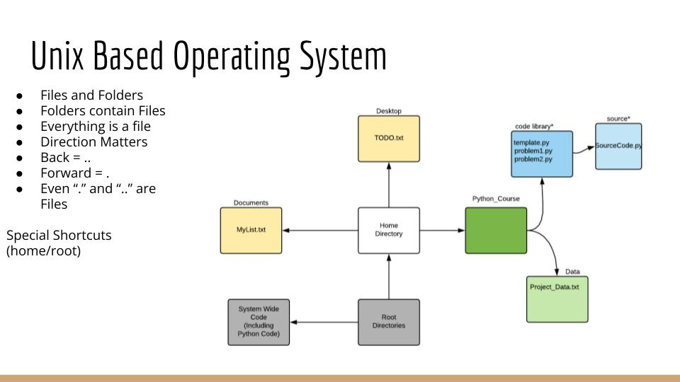

[//]: 

## Introduction to the Terminal 

The terminal allows you to navigate the Unix-Based OS, a simple system made up of files and folders. For this workshop, basic familiarity is 
required.  If you are unfamiliar please follow this guide. 

## Bash

Bash is the common name for the programming language used to navigate the terminal and manipulate files and folders.  There are 
[approximately 50 bash commands that used 95% of the time](https://www.ubuntupit.com/the-50-best-linux-commands-to-run-in-the-terminal/).  
We will go over some of the basics. 

### cd 

In the terminal, we can change our directory using the following command:
    
    cd <Path>

where <Path> is the path to the target directory.

cd stands for change directory
Some common usage of cd includes

    cd ~ # will bring you to your home directory
    cd ../ # will bring you to the parent directory (up one level)
    cd XXX # will bring you to the XXX directory

