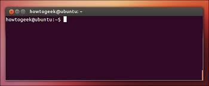
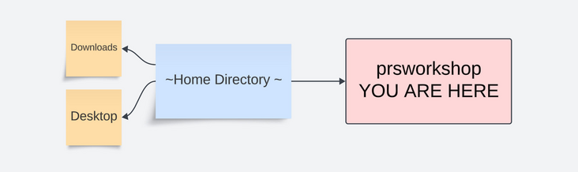
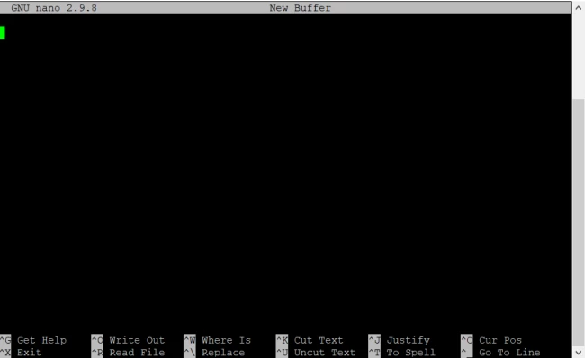

[//]: 


# Introduction to the Terminal   

Terminal programs allow you to navigate the Unix-Based OS, a simple system made up of files and folders. For this workshop, basic familiarity is required. This guide will get you up to speed.  
To begin open up a terminal window, by: 

1. `macOS:` Opening finder, type "terminal", and clicking on the icon. 
2. `Linux:` Opening the lower left hand start menu, typing "terminal" and clicking on the icon. 

A window will open up that looks something like this: 



# Bash

Bash is a programming language commly used to navigate the terminal and manipulate files and folders.  There are 
[approximately 50 bash commands that used 95% of the time](https://www.ubuntupit.com/the-50-best-linux-commands-to-run-in-the-terminal/).  We will go over some of the basics. 
To ensure that we are using bash, type "bash" and hit enter in the terminal.  Now type: 


    cd ~

The **cd** command [(learn more)](misc_commands.md#cd) stands for change directory, and **~** represents a shortcut to your "home" directory.  After typing this command, you are "in" your home directory.  Now type: 

    pwd

The **pwd** command returns your current "path", which represents the name and location of your home directory.
Because the name and location of the home directory differ from computer to computer, we use **~** or $HOME as 
a universal shortcut to represent your home directory.  Now type: 

    ls 

The command **ls** [(learn_more)](misc_commands.md#ls)lists the files and folders in your home directory.  These files and folders in the home directory 
will differ from computer to computer, but most filesystems will have a **Desktop** and **Downloads** folder in the 
home directory:  


 
Often the home directory of the filesystem can be quite crowded, which is why we would like to carry out this tutorial 
in a new directory specifically for the workshop.  To create this directory, type: 

    mkdir prsworkshop 

The **mkdir** command makes a new directory called prsworkshop that is located in your home directory: 


Next we can move to this newly created directory by typing: 

    cd prsworkshop  



To verify that we have sucessfully navigated to the **prsworkshop** directory we can use two 
commands the we have previously discussed. Fist, can you recall the command to list the current path?  
Can you predict what it will return? 

=== "goal"                                                                                                                                                                                                    
    ```R                                                                                                                                                                                                                    
    identify current path                                                                                                                                                                                                               
    ```                                                                                                                                                                                                                     
=== "command"                                                                                                                                                                                                    
    ```R                                                                                                                                                                                                                    
    pwd                                                                                                                                                                                                                
    ```                                                                                                                                                                                                                     
=== "[Result]"                                                                                                                                                                                                              
    ```R   
    $HOME/prsworkshop                                                                                                                                                                                                             
    ```          

Next, can you recall the command to list the contents of the directory?  Can you predict what it will return?  

=== "goal"                                                                                                                                                                                                    
    ```R                                                                                                                                                                                                                    
    list directory contents                                                                                                                                                                                                               
    ```                                                                                                                                                                                                                     
=== "command"                                                                                                                                                                                                    
    ```R                                                                                                                                                                                                                    
    ls                                                                                                                                                                                                            
    ```                                                                                                                                                                                                                     
=== "[Result]"                                                                                                                                                                                                              
    ```R   
         # nothing is returned because the new prsworkshop directory is empty 
    ```          

Hopefully, you were able to answer correctly above and understand that you are 
now in the empty prsworkshop directory.  Next we will create a file using the 
program [nano](https://www.nano-editor.org/) by typing: 

    nano test.sh 

This command will open up the nano text editor:  




On the top line type: 

    echo "hello world" 

Then save the file using **Ctrl-O** and press enter, and quit using **Ctrl-X**. 
Now type: 

    ls 

Do you see the file you just created?  To see the contents of the file you just created 
you can type: 

    cat test.sh 

Do you know that the file you just created can also run as program?  To execute the 
bash code that you have created you can type: 

    bash test.sh 

Congratulations, you have now navigated the filesystem, created a directory, created a file and executed a program!  You may feel like somewhat of an expert. However, if you still feel unfamiliar with shell scripting, please consider completing our 
[bash tutorial](misc_commands.md).  Otherwise, proceed to the next step, where you will install all system wide software necessary for the workshop. 


