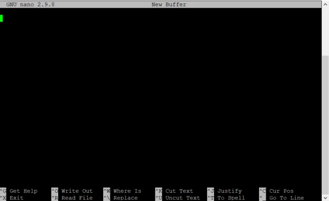

## Bash/Shell Tutorial


The ability to navigate the filesystem using bash is a very important skill in statistical genetics.  Bash is a programming language commonly used to navigate the terminal and manipulate files and folders.  Some terminals run "bash-like" scripting languages like "zsh".  For the purposes of this tutorial, they            
are indistinguishable from bash. There are [approximately 50 bash commands that used 95% of the time](https://www.ubuntupit.com/the-50-best-linux-commands-to-run-in-the-terminal/).  Here we will review some common commands and do some simple file analysis. 


## Common Commands

# cd  


This command is used to change our directory, in the following manner: 

       cd $PATH

where $PATH represents the path to the target directory. Common usage of cd includes: 

       cd ~/ # will bring you to your home directory
       
       cd $HOME # will bring you to your home directory

       cd ../ # will bring you to the parent directory (up one level)
       
       cd Downloads # will bring you to the Downloads directory, provided that you are in the home directory

       cd ~/Downloads # will bring you to Downloads, no matter where you are in the filesystem

#ls 

This command allows you to look at the contents of a directory:  

    ls 

Some common usage of ls includes: 
       
    ls # list the contents of the current directory 
    ls ~ # list the contents of the home directory 
    ls ~/Desktop # Will list the contents of the Desktop 

For **ls**, there are a number of additional Unix command options that you
can append to it to get additional information, for example:

        ls -l  # shows files as list

        ls -lh  # shows files as a list with human readable format

        ls -lt  # shows the files as a list sorted by time-last-edited

        ls -lS  # shows the files as a list sorted by size


#mkdir 

This command to create a new directory in your home folder: 

    mkdir ~/test_directory 

                                                                                                                                                                                                                            
!!! warning "The following commands should be carried out within this directory" 

    Use **cd** to enter the directory: 
    ```                                                                                                                                                                                                                     
    cd ~/test_directory wsl                                                                                                                                                                                        
                                                                                                                                                                                                                            
    ```
# echo 

Can be used to print to screen: 

    echo "Hello" 

 
# touch 

Can be used to create a new (empty) file: 

    touch foo  

# rm 

Can be used to create delete a file: 

    rm foo 

# > 

The carrot sign can be used to send the output to a file: 

    echo "Hello" > output.txt

# cat 

Can be used to print the contents of a file to the screen: 

    cat output.txt 

# cp 

Can be used to copy a a file: 

    cat output.txt output2.txt 


# nano 

Nano can be used to edit a file, typing: 

    nano data1.txt 

Will bring up an editor window: 


                                                                                                                                                                                             
                                                                                                                                                                                                                            
Starting from the top line type:                                                                                                                                                                                                       
                                                                                                                                                                                                                            
    bob   1
    fred  2 
    mary  3
    noah  4 
    sally 5    
                                                                                                                                                                                                                        
And then save the file using **Ctrl-O** and press enter, and quit using **Ctrl-X**.                                                                                                                                             

#wc 

The word count command can be used to count the number of lines or words in a file: 

        wc -l data1.txt


# grep 

Can be used to search a file for content: 

    grep "noah" data1.text 

While return all the lines in data1.txt containing the search term "noah". 


## File Analysis

A very powerful feature of the terminal is the **awk** programming
language, which allows us to extract subsets of a data file, filter
data according to some criteria or perform arithmetic operations on
the data. awk manipulates a data file by per- forming operations on
its **columns** - this is extremely useful for scientific data sets
because typically the columns features or variables of interest.

For example, we can use awk to produce a new file that squares the data in our previous file: 

    awk '{print $1,$2*$2}' data1.txt > data2.txt 

We can also use awk to add up all the squared data values: 

    awk '{X+=$2} END{print $2}' data2.txt 

 

